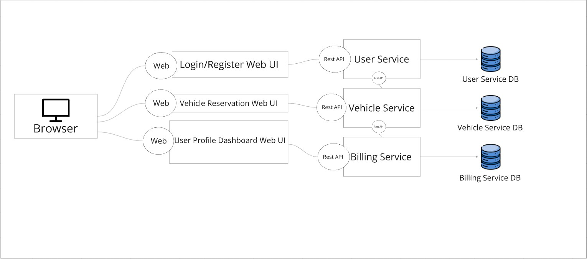

# CNAD-Assignment1
CNAD Assignment 1 - Joseph Bacomo Wan Zi Jun

# Electric Car Sharing System Microservice
This project implements a microservices-based electric-sharing system application/platform. The main few features and functions include allowing users to reserve vehicles, figure out their billing based on their membership type, rental duration and view their invoices. This project emphasies modular design using Go and adheres to a microservices architecture for scalability and maintainability.

## Design Considerations
The microservices for this project have been organised into separate services, each contained within their own respective folder for clarity, organisation and ease of maintenance. Each service is responsible for a specific functionality of the system, ensuring that they are loosely coupled and can evolve independently. Should a particular service fail, the application should remain functional as long as all services do not fail.

<h3><strong>Breakdown of Each Service</strong></h3>

- User Service: Responsible for the management of user information, including their username, email, password and membership type.

- Vehicle Service: Handles the collection of vehicles on the platform, vehicle reservations

- Billing Service: Responsible for calculating the total amount for a reservation and applying discounts based on the type of membership a user has, and storing their respective invoices.

## Microservices Architecture Diagram




## Instructions for Setting Up and Running Microservices

<h3><strong>Prerequisities</strong></h3>

- **Go:** Install Go for development
- **Database:** Install MySQL for setting up the databases for each service of the application through executing the database script as provided.

<h3><strong>Clone the Repository</strong></h3>


```
git clone https://github.com/josephwan21/CNAD-Assignment1.git
```


<h3><strong>Running each microservice</strong></h3>

Since each microservice contains a "main.go" in each of their respective folders, they would have to be run through separate command line interfaces

Running the User Service:

```
cd path-to-repo/carsharinguserservice
```

```
go run main.go
```

Running the Vehicle Service:

```
cd path-to-repo/carsharingvehicleservice
```

```
go run main.go
```

Running the Billing Service:

```
cd path-to-repo/carsharingbillingservice
```

```
go run main.go
```


